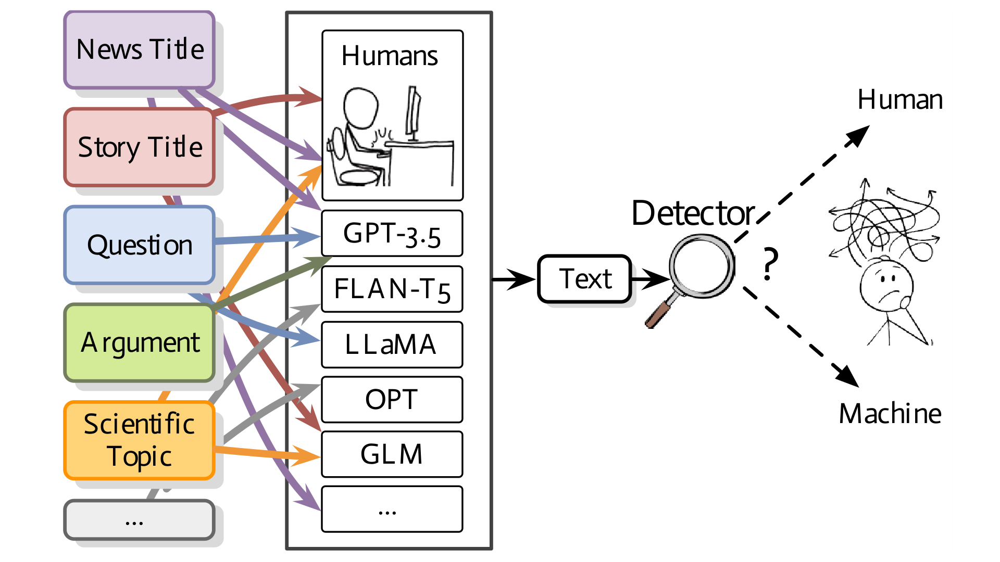

  

<h1>Reproducibility Study: MAGE - Machine-generated Text Detection in the Wild</h1>

 

 

_**Reproducibility Authors:** Aman Laiq Mohammed, Jagriti Bhandari_

_**Original Authors:** Yafu Li, Qintong Li, Leyang Cui, Wei Bi, Zhilin Wang, Longyue Wang, Linyi Yang, Shuming Shi, Yue Zhang_

## 📌 Table of Contents
- [Reproducibility Study](#-reproducibility-study)
- [Introduction](#-introduction)
- [Activities](#-activities)
- [Dataset](#-dataset)
- [Reproducibility Instructions](#-reproducibility-instructions)
- [Results](#-results)
- [Citation](#-citation)

## 🚀 Reproducibility Study
This repository is part of a reproducibility study for the paper "[MAGE: Machine-generated Text Detection in the Wild](https://aclanthology.org/2024.acl-long.3/)". These instructions assist researchers and practitioners in verifying and reproducing the results presented in the original study.

## 📝 Reproducibility Instructions

### 1. Sourcing the Authors' Code
The source code for the research paper can be accessed at [Original Repository](https://github.com/yafuly/MAGE).

### 2. Cloning and Setup
Clone the repository and set up the environment using:

git clone https://github.com/yafuly/MAGE.git
cd MAGE
python -m venv mage_env
mage_env\Scripts\activate

### 3. Installation of Libraries
Install necessary libraries from the provided `requirements.txt`:

pip install -r requirements.txt

### 4. Preparing the Testbed
Prepare the dataset testbeds using the script below, The code prepare_testbeds.py requires an argument which is the path to the folder in which the code outputs/creates the testbeds:

python deployment/prepare_testbeds.py path_to_data_folder

### 5. Running the Model
Execute the main model training and evaluation script (Make sure to include the locations/paths for training data, validation data, and testing data):

python training/longformer/main.py --model_name_or_path allenai/longformer-base-4096 --train_file path_to_train.csv --validation_file path_to_valid.csv --test_file path_to_test.csv --output_dir results/my_test_results --do_train --do_eval --do_predict --overwrite_output_dir --fp16

### 6. Examining the Results
The results of our reproducibility study are presented as follows.

## 📊 Results
The experiments were conducted across multiple detection scenarios, replicating the setups in the original paper. The primary results obtained using the Longformer-based detector are grouped into two categories: **In-Distribution Detection** and **Out-of-Distribution Detection**. The detailed results are presented in the table below:

#### Table 1: Detection Performance of Longformer-based Model in Various Experimental Settings

| Testbed | Settings                            | HumanRec | MachineRec | AvgRec | AUROC |
| ------- | ----------------------------------- | -------- | ---------- | ------ | ----- |
| 2,3,4   | Arbitrary Domains & Model-Specific | 95.30%   | 96.70%     | 96.00% | 0.99  |
|         | Fixed Domain & Arbitrary Models    | 89.78%   | 97.37%     | 93.57% | 0.99  |
|         | Arbitrary Domains & Arbitrary Models | 82.60%   | 98.10%     | 90.35% | 0.99  |
| 5,6     | Unseen Models                      | 83.00%   | 89.70%     | 86.35% | 0.95  |
|         | Unseen Domains                     | 37.50%   | 99.10%     | 68.30% | 0.93  |

For a more in-depth understanding of our Reproducibility study, please go through Reproducibilty_Report.pdf. 
